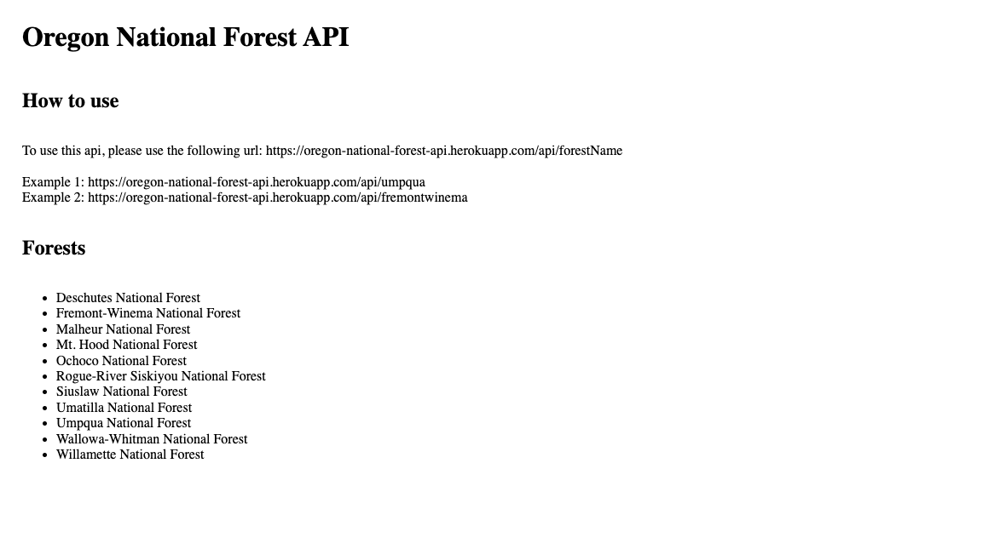

# Oregon National Forest API
This API contains the names, date established, acres, location, and links to the official sites of all 11 National Forests in the state of Oregon.

Link to project: [Here](https://oregon-national-forest-api.herokuapp.com/api/umpqua)

# How It's Made:
Tech used: HTML, CSS, JavaScript, Node.js, Express

I used Node and Express to build an API.

# Optimizations
Styling soon to come.

# Lessons Learned:
This was great practice in using Node and Express to build an API. Having this knowledge opens up so many doors for me to continue building future projects.
